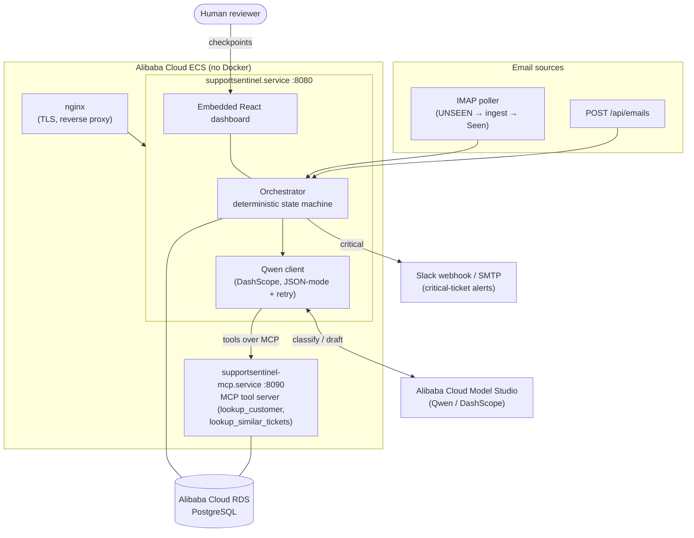
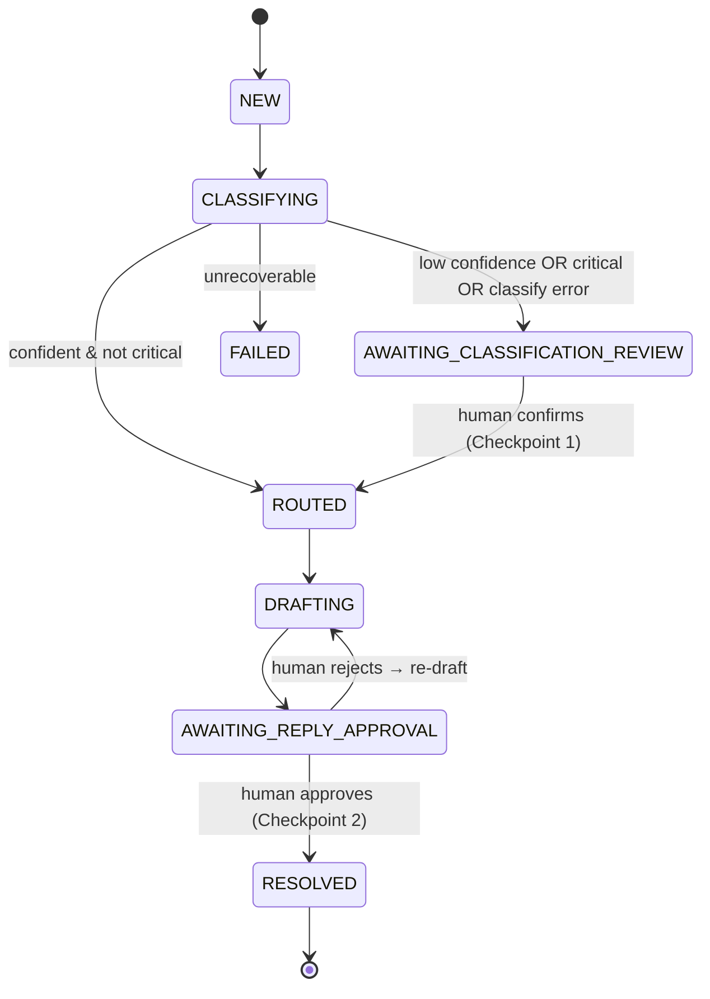

# SupportSentinel

> Autopilot support-ticket agent — turns inbound support emails into triaged, routed, and drafted-reply tickets with two human-in-the-loop checkpoints. Built on **Qwen via Alibaba Cloud Model Studio (DashScope)**.

**Hackathon Track 4: Autopilot Agent (QwenCloud / Alibaba Cloud).** Open source under the MIT License.

SupportSentinel ingests support emails (HTTP or IMAP), classifies **urgency** and **type** with Qwen — invoking tools over the **Model Context Protocol** to disambiguate hard cases — routes them through a deterministic state machine, and parks low-confidence or critical tickets for human review. Every reply is human-approved before it would be sent. Every state change is written to an append-only audit log in the same transaction. **It fails toward a human — it never silently drops a ticket.**

## Why this matters

Support teams drown in inbound email: triage is slow, inconsistent, and the urgent ticket hides among the routine ones. SupportSentinel automates the triage-and-draft loop while keeping a human in control of anything risky — a production-shaped workflow (auditability, resilience, evaluation), not a chatbot demo. It is built to be deployed (single binary + systemd + nginx on Alibaba Cloud ECS, PostgreSQL on RDS) and to be measured (a calibrated evaluation harness, below).

## Architecture



The classifier consumes its tools over MCP at runtime (`MCP_SERVER_URL`), falling back to in-process tools if the MCP service is unset or unreachable — the classify loop is identical either way.

## State machine



- **Checkpoint 1:** `confidence < CONFIDENCE_THRESHOLD` OR `urgency == critical` → park for human review (critical always parks **and** alerts).
- **Checkpoint 2:** every drafted reply is human-approved (or rejected → re-drafted) before it would be sent.
- Every transition goes through `store.Apply`, which writes the `audit_log` row in the **same transaction**. `classifications` / `replies` / `audit_log` are append-only (full replay).

## Proof of Alibaba Cloud

The AI core is **Qwen on Alibaba Cloud Model Studio (DashScope)** — see [`internal/qwen/client.go`](internal/qwen/client.go): an OpenAI-compatible DashScope client doing JSON-mode classification with schema validation + one re-prompt, function-calling (tools), and bounded exponential-backoff retry. Persistence is **Alibaba Cloud RDS PostgreSQL** via `DATABASE_URL`. In production both run on **Alibaba Cloud ECS** (see [deploy/](deploy/)).

## Sophisticated Qwen usage

- **Function-calling tool loop** — during classification the model can call `lookup_customer` (account tier/status by email) and `lookup_similar_tickets` (how past tickets were classified) to disambiguate; invocations are recorded in `classifications.tools_used`.
- **Tools over MCP** — those tools are exposed via the **Model Context Protocol** (`internal/mcp`, `cmd/mcp-server`, built on `mark3labs/mcp-go`, Streamable HTTP). The classifier consumes them over MCP at runtime, so the tool layer is reusable by any MCP host. Schemas surfaced over MCP are verified identical to the in-process definitions.
- **JSON-mode + validation + re-prompt**, **bounded retry** (4xx non-retryable), and a **fake classifier fallback** when no API key is set (keeps the pipeline runnable offline).

## Evaluation (calibrated, not guessed)

`make eval` runs a 30-email gold dataset through the classifier and prints accuracy, per-class precision/recall/F1, confusion matrices, and a confidence-threshold calibration sweep. Latest live run (qwen3.7-plus):

| Dimension | Accuracy |
|---|---|
| Type | 86.7% |
| Urgency | 83.3% |
| Both correct | ~70% |

The calibration sweep recommends the HITL threshold (`CONFIDENCE_THRESHOLD`); urgency is the weaker axis, so the harness recommends routing conservatively. `make eval` replays a committed cache (free, offline); `make eval-live` refreshes it against live Qwen.

## Quickstart (local)

```bash
# Prereqs: Go 1.25+, Node 18+ (for the dashboard build), PostgreSQL.
cp app.env.example app.env          # fill in DATABASE_URL and DASHSCOPE_API_KEY
make test-db                        # create local dev + test databases
make run                            # build dashboard + run server → http://localhost:8080
```

Without `DASHSCOPE_API_KEY` the server uses a deterministic fake classifier, so the pipeline runs offline. Optional: `make mcp` (tool server), `make eval` (quality report).

### Submit a ticket

```bash
curl -sX POST localhost:8080/api/emails -H 'content-type: application/json' \
  -d '{"from":"customer@acme.com","subject":"Production is down","body":"All API calls 500 since 14:00, checkout is broken."}'
```

Then open http://localhost:8080 to review, approve, or override.

## API

| Method | Path | Purpose |
|---|---|---|
| POST | `/api/emails` | Ingest an email (creates + classifies a ticket) |
| GET | `/api/tickets` | List tickets (review queue) |
| GET | `/api/tickets/{id}/detail` | Ticket detail (reasoning, confidence, tools used) |
| GET | `/api/tickets/{id}/audit` | Append-only audit timeline |
| POST | `/api/tickets/{id}/classification-review` | Checkpoint 1: confirm/override routing |
| POST | `/api/tickets/{id}/reply-approval` | Checkpoint 2: approve/reject the drafted reply |

## Tech stack

Go 1.25 (net/http, jackc/pgx v5, google/uuid) · Qwen via Alibaba Cloud DashScope · Model Context Protocol (mark3labs/mcp-go) · PostgreSQL (local / Alibaba RDS) · Vite + React + TypeScript + Tailwind (embedded via `//go:embed`) · systemd + nginx on Alibaba Cloud ECS (no Docker).

See [docs/architecture.md](docs/architecture.md) for a deeper walkthrough and [deploy/README.md](deploy/README.md) for the deployment runbook.

## Deployment

No Docker — a single cross-compiled binary per service, systemd, and nginx on Alibaba Cloud ECS, with PostgreSQL on Alibaba Cloud RDS. One-command re-deploy:

```bash
DEPLOY_HOST=<ecs-public-ip> DEPLOY_USER=<user> make deploy
```

First-time setup (ECS, RDS, self-signed TLS, systemd units) is documented in [deploy/README.md](deploy/README.md).

## License

[MIT](LICENSE).
