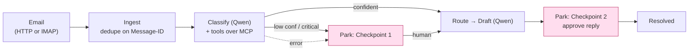

# Architecture

Autocierge is a deterministic agent: a Go state machine drives every ticket from ingestion through two human-in-the-loop checkpoints, calling Qwen for the non-deterministic parts (classification, reply drafting) and recording every step in an append-only audit log.

## Components

| Package | Responsibility |
|---|---|
| `internal/domain` | Fixed taxonomies (urgency/type/department), the `Ticket` model, and the `Classifier`/`ToolBox` interfaces. |
| `internal/orchestrator` | The state machine. Gates routing on confidence + criticality; fails toward a human. |
| `internal/qwen` | Qwen/DashScope client: JSON-mode classification (validate + one re-prompt), function-calling tool loop, bounded retry, free-text reply drafting. **The Alibaba Cloud proof file.** |
| `internal/tools` | The agent's tools (`lookup_customer`, `lookup_similar_tickets`), store-backed. |
| `internal/mcp` | The same tools exposed over the Model Context Protocol + an MCP-client-backed `ToolBox` the classifier consumes at runtime. |
| `internal/ingest`, `internal/ingest/imap` | Email parsing (RFC 822, RFC 2047 subjects, HTML→text) and the IMAP poller. |
| `internal/alert` | Best-effort Slack + SMTP fan-out for critical tickets (failures never block the pipeline). |
| `internal/store` | PostgreSQL access (pgx), transactional `Apply`, embedded schema. |
| `internal/httpapi`, `internal/webui` | HTTP API + the embedded React dashboard. |
| `internal/eval`, `cmd/eval` | Gold-dataset evaluation harness + confidence calibration. |

## Data flow

## Core principles

- **Fail toward a human.** Classifier errors park the ticket for review (`AWAITING_CLASSIFICATION_REVIEW`) with the error recorded — never dropped.
- **Transactional audit.** Every state change goes through `store.Apply`, which writes the `audit_log` row in the same DB transaction. `classifications` / `replies` / `audit_log` are append-only, enabling full replay.
- **Deterministic core, probabilistic edges.** The state machine and routing are deterministic Go; only classification and drafting call the model.

## Deployment topology

Two systemd-managed binaries on one ECS instance — `autocierge.service` (API + embedded dashboard, `:8080`) and `autocierge-mcp.service` (MCP tool server, `:8090`, localhost-only). nginx terminates TLS and reverse-proxies the public interface to `:8080`. PostgreSQL is Alibaba Cloud RDS. See [../deploy/README.md](../deploy/README.md).
